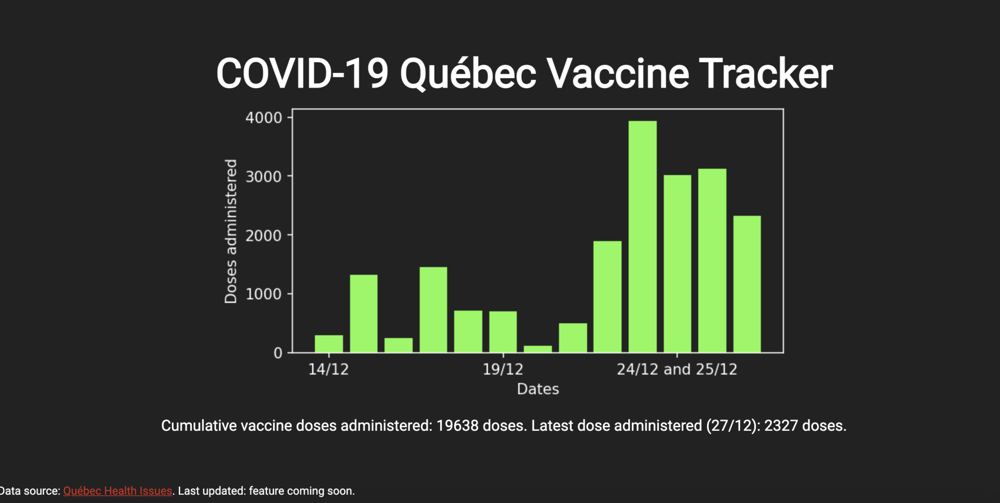

# COVID-19 Vaccine Tracker
What the site currently looks like: 

Website demo: <http://diegolopez.me/vaccine-tracker/> 

## Instructions to Run Locally

1. In the command line, run `main.py`
2. In your web browser, go to <http://localhost:8080/> 
3. Open `index.html` in your web browser. 

## Instructions to run on a Google VM

Whenever you change `main.py`, you need to re-build the Docker file. These are the steps to do so:
1. `sudo docker build --tag webdev/vaccine-tracker .`

You will see the following output near the end: `Successfully built <container id>`, where `<container-id>` is the ID of the container. You will then want to use `nohup` to run this process in the background with the following command:

2. `nohup sudo docker run -p 80:56666 <container id> > output.txt&`

You can view the output in `output.txt`.